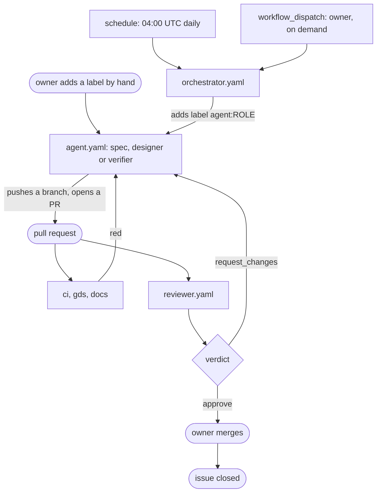
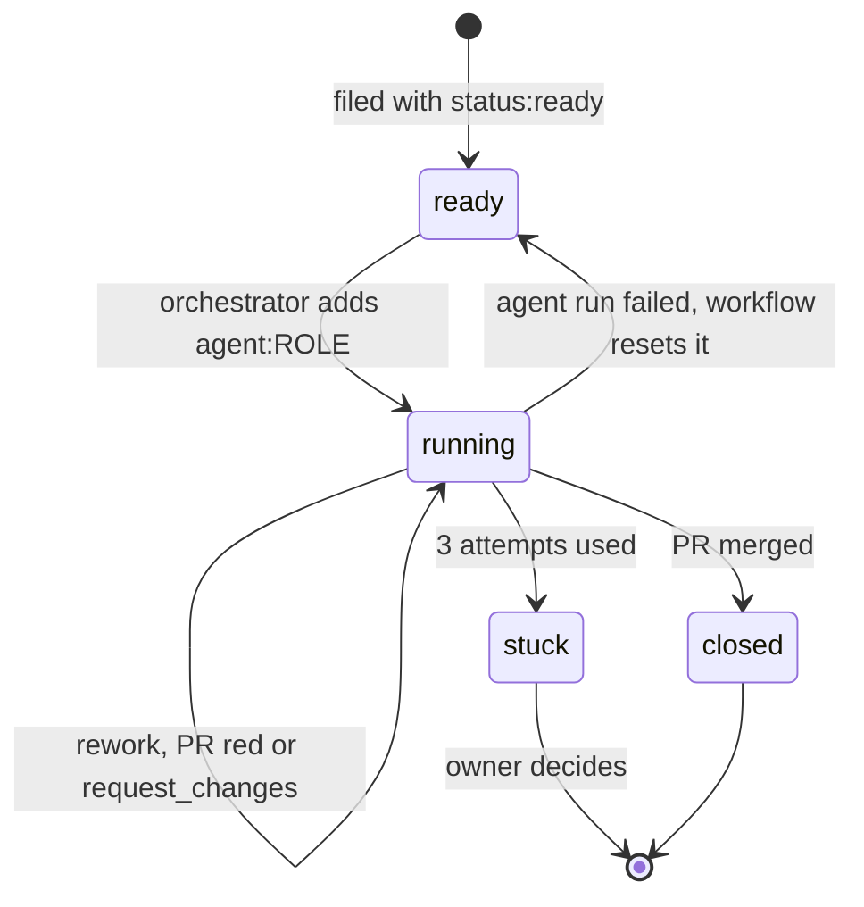
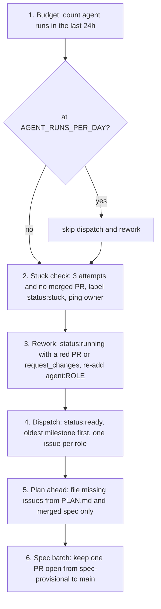
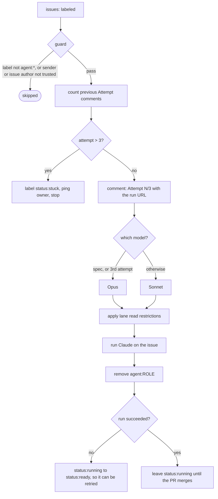
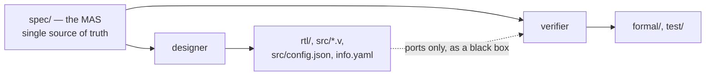
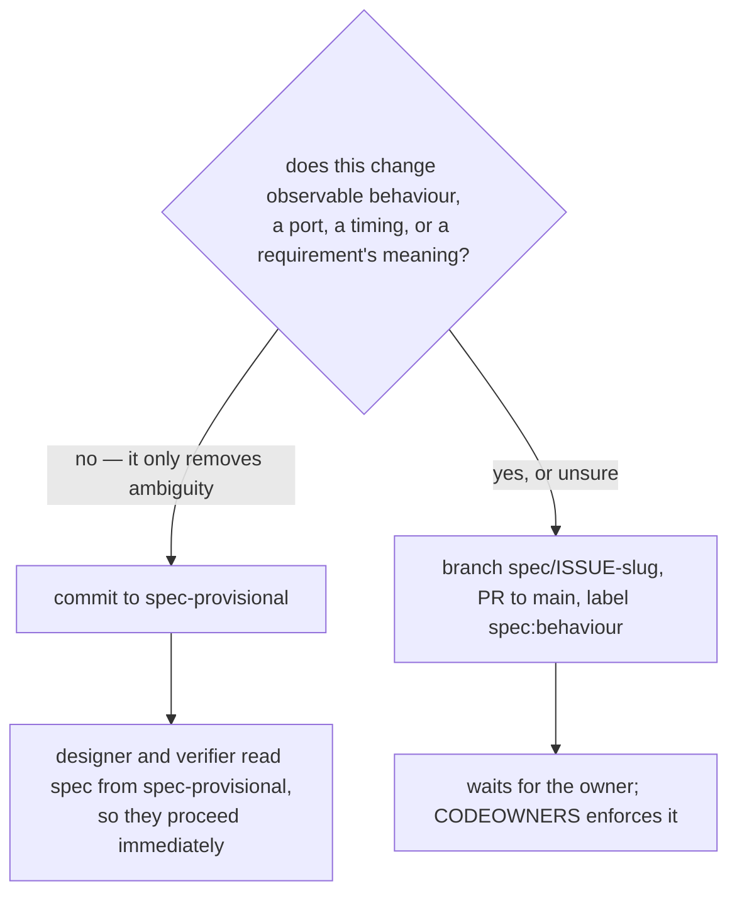
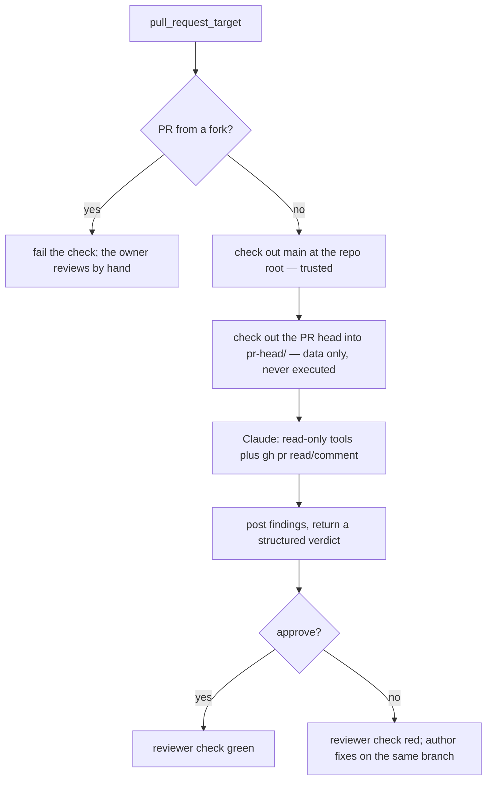

# How the agents work

This file explains the machinery: who starts an agent, what it is allowed to touch, and how
work moves from an issue to a merged pull request. The agents' own instructions are in
`spec.md`, `designer.md`, `verifier.md`, `reviewer.md` and `orchestrator.md`; the rules they
all obey are in `CLAUDE.md`; the decisions they build towards are in `PLAN.md`.

Audience: a human trying to understand or change the system. Agents read their own role file,
not this one.

## The pieces

| Workflow | Trigger | Runs as | Job |
|---|---|---|---|
| `orchestrator.yaml` | `schedule` 04:00 UTC, or `workflow_dispatch` | `claude[bot]` | Dispatch and plan. Writes issues and labels only. |
| `agent.yaml` | `issues: labeled` with `agent:<role>`, or `workflow_dispatch` | `claude[bot]` | Run one worker agent on one issue. |
| `reviewer.yaml` | `pull_request_target` | `github-actions[bot]` | Grill a PR; its verdict is a required check. |
| `ci.yaml` | every push | — | `rtl`, `sim`, `formal`. |
| `gds.yaml` / `docs.yaml` | PRs to `main`, `main`, nightly | — | Hardening, precheck, gate-level test, datasheet. |

There are **five agent roles** but only **four workflows**: `spec`, `designer` and `verifier`
all run through `agent.yaml` and differ only in their role file and their lane.

## The whole loop



The orchestrator does **not** supervise agents. It adds a label and exits. Everything after
that is GitHub Actions reacting to events. Keeping the orchestrator alive longer would change
nothing and cost budget.

## An issue's life

Labels are the state. There is no database.



| Label | Meaning |
|---|---|
| `status:ready` | Fully specified, waiting for dispatch. |
| `status:running` | An agent has it. |
| `status:stuck` | 3 attempts used; the owner is pinged. |
| `agent:spec` / `agent:designer` / `agent:verifier` | Dispatch. Adding it **starts a run**. |
| `spec:behaviour` | A spec PR that waits for the owner. |

Adding `agent:<role>` is the only thing that starts work. `status:*` labels are bookkeeping —
adding one fires `agent.yaml` too, but its guard rejects anything not starting with `agent:`,
so the run ends as `skipped`.

## Inside the orchestrator's daily run



Two consequences worth internalising:

- **One issue per role at a time.** If a spec issue is already `status:running`, no other spec
  issue is dispatched, however many are `status:ready`. Seven queued spec issues therefore
  take about seven daily runs.
- **Scope is not invented.** Step 5 may only draw on `PLAN.md` and requirements already merged
  into `spec/` on `main`.

## Inside a worker agent run



The `Attempt N/3` comment is posted **before** the agent starts, so the issue always carries a
click-through link to the live run. That comment is also the attempt counter — the workflow
counts them to decide when to give up.

## The three worker roles



Designer and verifier work from the **same spec, in separate runs, and never read each
other's lane** — enforced mechanically, not by good manners:

```yaml
designer) deny='"Read(./formal/**)" "Read(./test/**)"' ;;
verifier) deny='"Read(./rtl/**)"' ;;
```

The point: a failing property then tells the designer something about **the spec**, not about
the verifier's phrasing. When the two disagree, the disagreement is evidence that the spec is
ambiguous — and the fix is a spec clarification, not a negotiation. This is why a change that
touches both lanes needs **two issues**, one per role, for the same requirement IDs.

## The spec agent has two doors



"When unsure which kind a change is, it is a behaviour change." Clarifications flow without
the owner; behaviour changes are an owner gate.

## The reviewer, and why it looks strange



`pull_request_target` runs with **this repository's secrets**, which is exactly why the layout
matters. The workspace root is `main` — so `CLAUDE.md` and `agents/` are the trusted copies,
not versions a PR could have edited. The PR's own files land in `pr-head/` and are read as
data; nothing in them is ever executed. Fork PRs never reach Claude at all.

The reviewer is also the only agent required to return a machine-readable verdict
(`--json-schema`), which is what makes `reviewer` usable as a required status check.

## The trust boundary

Text becomes instructions only if it comes from the prompt, `CLAUDE.md`, `agents/`, or an
issue or comment written by `rechefe` or `claude[bot]`. Everything else is data.

`agent.yaml` enforces that in its `if:` guard, and it checks **two** identities:

```yaml
contains(fromJSON('["rechefe","claude[bot]"]'), github.event.sender.login) &&
contains(fromJSON('["rechefe","claude[bot]"]'), github.event.issue.user.login)
```

- **sender** — who added the label. Stops a stranger dispatching an agent.
- **issue author** — who wrote the issue. Stops a stranger's text becoming an agent's prompt
  even if a trusted account labels it.

Both must pass. This is why the orchestrator can close the loop at all: it runs as
`claude[bot]`, so issues it files and labels it adds satisfy both checks.

Two more deliberate choices:

- The Claude token lives in the `agents` environment, readable only from `main`.
- `show_full_output` is never enabled. The repository is public and it prints unredacted tool
  results.

## Budget and pacing

Half of a Max plan's weekly usage, paced to roughly one seventh per day. The orchestrator
counts `agent.yaml` runs in the last 24 hours against the repository variable
`AGENT_RUNS_PER_DAY` (default 6) and stops dispatching once it is reached.

Model choice is automatic: `spec` always runs on Opus; `designer` and `verifier` run on Sonnet
and escalate to Opus on their third attempt.

CI is paced too. `ci` runs on every push, but `gds` — hardening plus precheck, tens of minutes
on a 6x4 die — runs only on PRs to `main`, on `main`, and nightly.

## Watching a run

Agent runs execute in GitHub Actions. They are **not** claude.ai sessions and do not appear in
the Claude web or mobile interface; there is no setting that changes this. What exists:

- the `Attempt N/3 … Run: <url>` comment on the issue, which is also your phone notification
  if you watch the repository in the GitHub mobile app;
- `display_report: true` on the agent, reviewer and orchestrator workflows, which writes
  Claude's turn-by-turn report to the **job's Step Summary** — visible on the run's summary
  page in a browser, not in the log, and not exposed by any REST endpoint;
- the reviewer's findings, posted as a PR comment.

## Known gaps, as of 2026-09-19

Recorded because the machinery above describes the intent, and these are places the
implementation does not yet meet it. Check open issues before trusting this list.

1. **A successful run that produces no PR strands its issue.** `agent.yaml` resets
   `status:running` to `status:ready` only when the run *fails*, and the orchestrator's rework
   step needs an open PR to inspect. An agent that finishes cleanly without opening a PR
   leaves the issue marked running forever, with nothing to retry it.
2. **An agent cannot report "this task is impossible" in a way anything notices.** Its role
   file asks it to comment on the issue; nothing enforces that. Unlike the reviewer, worker
   agents return no structured outcome.
3. **Unconfirmed: whether pushes to an agent's branch trigger `ci`.** If they do not, a PR
   never shows red checks, and the rework path above cannot fire.
