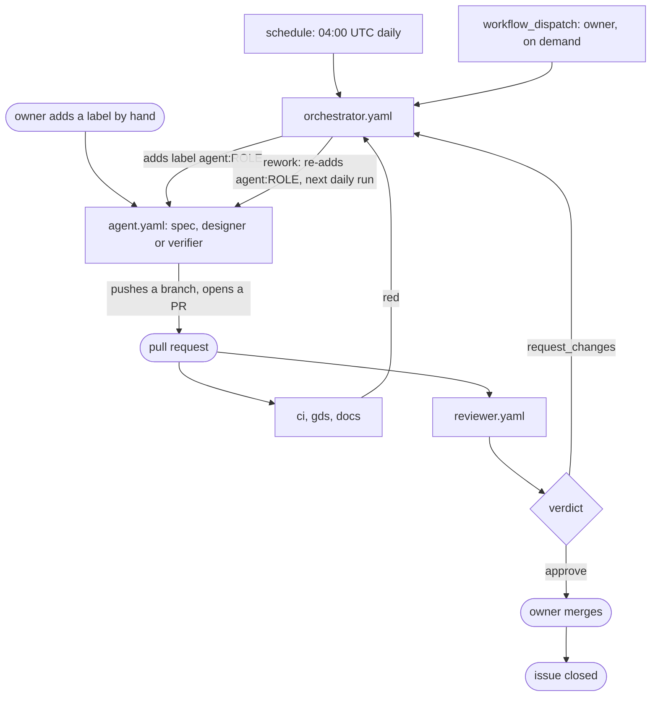
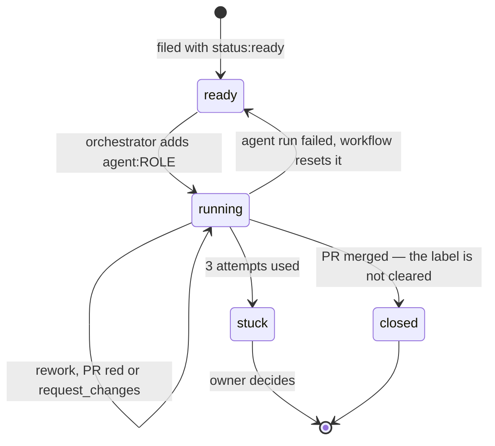
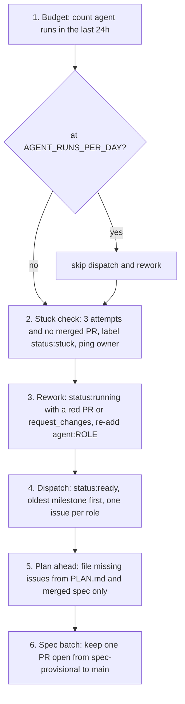
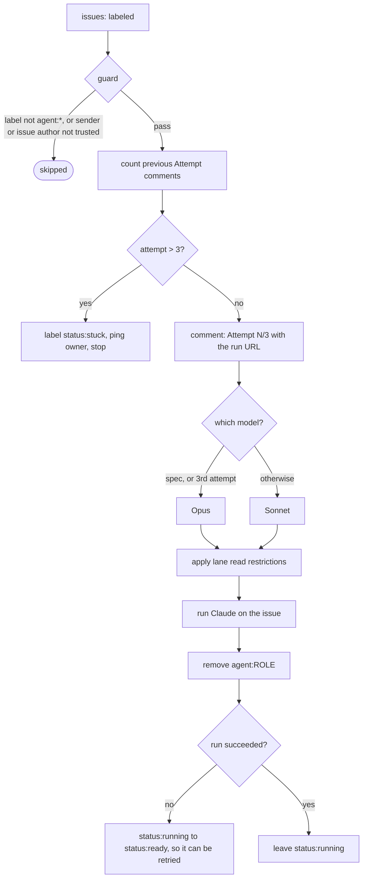
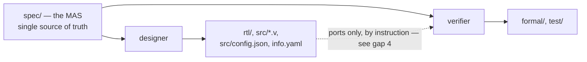
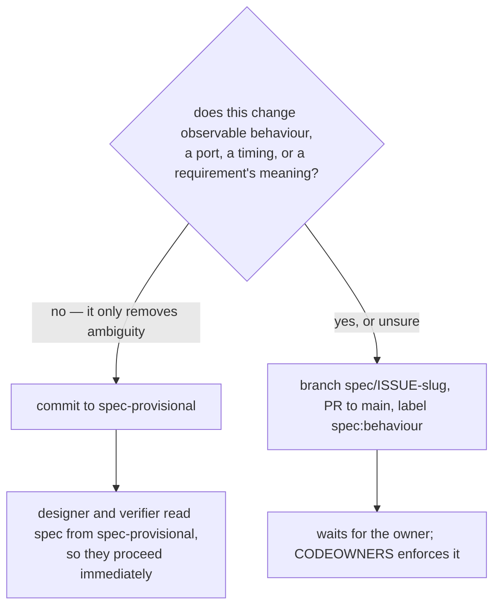
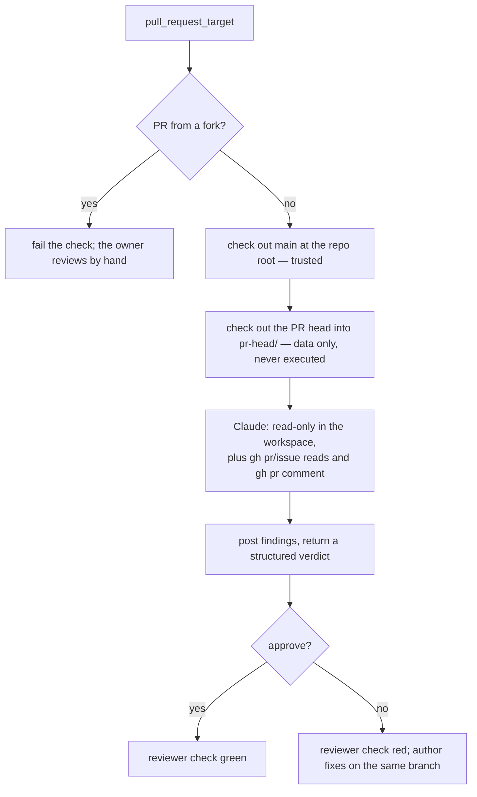

# How the agents work

This file explains the machinery: who starts an agent, what it is allowed to touch, and how
work moves from an issue to a merged pull request. The agents' own instructions are in
`spec.md`, `designer.md`, `verifier.md`, `reviewer.md` and `orchestrator.md`; the rules they
all obey are in `CLAUDE.md`; the decisions they build towards are in `PLAN.md`.

Audience: a human trying to understand or change the system. Agents read their own role file,
not this one.

## The pieces

| Workflow | Trigger | Runs as | Job |
|---|---|---|---|
| `orchestrator.yaml` | `schedule` 04:00 UTC, or `workflow_dispatch` | `claude[bot]` | Dispatch and plan. Writes issues, labels, comments and the spec batch PR — no file changes. |
| `agent.yaml` | `issues: labeled` with `agent:<role>`, or `workflow_dispatch` | `claude[bot]` | Run one worker agent on one issue. |
| `reviewer.yaml` | `pull_request_target` | `github-actions[bot]` | Grill a PR; its verdict is a required check. |
| `ci.yaml` | every push, or `workflow_dispatch` | — | `rtl`, `sim`, `formal`. |
| `gds.yaml` / `docs.yaml` | PRs to `main`, `main`, nightly, or `workflow_dispatch` | — | Hardening, precheck, gate-level test, datasheet. `gds` also has a `viewer` job that deploys the layout to Pages with `pages: write` — the only write permission outside the three agent workflows — skipped on `pull_request` so a PR cannot publish over `main`'s. |
| `setup.yaml` | `workflow_dispatch` only | — | One-time and idempotent: creates the label set and the `spec-provisional` branch everything else leans on. |
| `fpga.yaml` | `workflow_dispatch` only — `branches: none` disables its push trigger | — | iCE40UP5K bitstream, the stock Tiny Tapeout target. Never wired into the agent loop, and not the board `PLAN.md` names — see gap 5. |

There are **five agent roles** carried by **three** workflows: `orchestrator.yaml`,
`reviewer.yaml`, and `agent.yaml` — which runs `spec`, `designer` and `verifier`, differing
only in their role file and their lane. The other five files build, harden or set up the
repository; no agent runs in them.

## The whole loop



The orchestrator does **not** supervise agents. It adds a label and exits, and the **forward**
path — push, PR, checks, review — is GitHub Actions reacting to events.

**The return path is not.** Nothing fires on a red check or a `request_changes` verdict:
`reviewer.yaml` merely exits non-zero, `ci.yaml` has no downstream trigger, and `agent.yaml`
listens only for `issues: labeled` and `workflow_dispatch`. The only thing that puts an issue
back to work is the orchestrator's **step 3, Rework**, on its *next scheduled run*. Three
consequences follow, and they are the ones that actually bite:

- a red PR can sit up to **~24 hours** before anything touches it;
- the retry is charged against `AGENT_RUNS_PER_DAY`;
- it burns one of the issue's **three attempts**.

Keeping the orchestrator alive longer fixes none of that — the retry lands on the next run
either way, and polling in between costs budget for no information.

## An issue's life

Labels are the state. There is no database.



| Label | Meaning |
|---|---|
| `status:ready` | Fully specified, waiting for dispatch. |
| `status:running` | An agent has it. |
| `status:stuck` | 3 attempts used; the owner is pinged. |
| `agent:spec` / `agent:designer` / `agent:verifier` | Dispatch. Adding it **starts a run**. |
| `spec:behaviour` | A spec PR that waits for the owner. |

Adding `agent:<role>` is the only thing that starts work. `status:*` labels are bookkeeping —
adding one fires `agent.yaml` too, but its guard rejects anything not starting with `agent:`,
so the run ends as `skipped` — though it still appears in the run list the budget counts. See
gap 6.

## Inside the orchestrator's daily run



Two consequences worth internalising:

- **One issue per role at a time.** If a spec issue is already `status:running`, no other spec
  issue is dispatched, however many are `status:ready`. Seven queued spec issues therefore
  take about seven daily runs.
- **Scope is not invented.** Step 5 may only draw on `PLAN.md` and requirements already merged
  into `spec/` on `main`.

**On Sundays it has a second mode.** `orchestrator.yaml` branches on the day of the week — or
on the `digest` boolean of a manual dispatch — and opens a `Digest YYYY-Www` issue: merged PRs
per milestone, milestone status, agent runs against budget, open `status:stuck` issues, spec
PRs awaiting the owner, and **every `## Weakened properties` section merged that week**. That
last one matters: `CLAUDE.md` requires a PR that removes or loosens a property to declare it,
and the digest is the only place those declarations reach a human.

## Inside a worker agent run



The `Attempt N/3` comment is posted **before** the agent starts, so the issue always carries a
click-through link to the live run. That comment is also the attempt counter — the workflow
counts them to decide when to give up.

Note the asymmetry on the last two branches: a **failed** run resets the issue to
`status:ready` and so does the stuck path, but nothing clears `status:running` on **success**. No workflow reacts to a merge, so an
issue closed by its PR's `Closes #<issue>` stays closed *and* labelled `status:running`
forever. Harmless — the orchestrator's invariant is scoped to open issues — but it is the same
asymmetry as gap 1, in its benign form.

## The three worker roles



Designer and verifier work from the **same spec, in separate runs, and are told not to read
each other's lane.** `agent.yaml` denies the **Read tool** on those paths:

```yaml
designer) deny='"Read(./formal/**)" "Read(./test/**)"' ;;
verifier) deny='"Read(./rtl/**)"' ;;
```

**That is a guard rail, not a sandbox.** The same run allows
`--allowedTools "Bash,Read,Edit,Write,Glob,Grep,TodoWrite"`, and `Bash` is unrestricted — an
agent that ran `cat formal/uart_tx_props.v` would not be stopped, and `Edit`/`Write` into the
other lane are not denied either. The separation rests on the deny list *plus* the role files
in `designer.md` and `verifier.md`. See gap 4 below.

The point of the separation: a failing property then tells the designer something about **the
spec**, not about the verifier's phrasing. When the two disagree, the disagreement is evidence
that the spec is ambiguous — and the fix is a spec clarification, not a negotiation. This is
why a change that touches both lanes needs **two issues**, one per role, for the same
requirement IDs.

## The spec agent has two doors



"When unsure which kind a change is, it is a behaviour change." Clarifications flow without
the owner; behaviour changes are an owner gate.

## The reviewer, and why it looks strange



`pull_request_target` runs with **this repository's secrets**, which is exactly why the layout
matters. The workspace root is the PR's **base** branch — `main` for every PR here, since the checkout takes no `ref:` — so `CLAUDE.md` and `agents/` are the trusted copies,
not versions a PR could have edited. The PR's own files land in `pr-head/` and are read as
data; nothing in them is ever executed. Fork PRs never reach Claude at all.

The reviewer is also the only agent required to return a machine-readable verdict
(`--json-schema`), which is what makes `reviewer` usable as a required status check.

## The trust boundary

Text becomes instructions only if it comes from the prompt, `CLAUDE.md`, `agents/`, or an
issue or comment written by `rechefe` or `claude[bot]`. Everything else is data.

`agent.yaml` enforces that in its `if:` guard:

```yaml
github.event_name == 'workflow_dispatch' ||
(startsWith(github.event.label.name, 'agent:') &&
 contains(fromJSON('["rechefe","claude[bot]"]'), github.event.sender.login) &&
 contains(fromJSON('["rechefe","claude[bot]"]'), github.event.issue.user.login))
```

On the **label path**, two identities are checked and both must pass:

- **sender** — who added the label. Stops a stranger dispatching an agent.
- **issue author** — who wrote the issue. Stops a stranger's text becoming an agent's prompt
  even if a trusted account labels it.

That both hold for `claude[bot]` is why the orchestrator can close the loop at all: issues it
files and labels it adds satisfy the checks.

The leading `workflow_dispatch ||` is a **deliberate bypass of both**. Triggering a workflow by
hand already requires write access to the repository, so the sender is trusted by construction
— but note what it does *not* check: a manual dispatch names an issue number directly, so it
can point an agent at an issue written by anyone. Dispatching by hand means vouching for the
issue's text yourself.

Two more deliberate choices:

- The Claude token lives in the `agents` environment, readable only from `main`.
- `show_full_output` is never enabled. The repository is public and it prints unredacted tool
  results.

## Budget and pacing

Half of a Max plan's weekly usage, paced to roughly one seventh per day. The orchestrator
counts `agent.yaml` runs in the last 24 hours against the repository variable
`AGENT_RUNS_PER_DAY` (default 6) and stops dispatching once it is reached.

Model choice is automatic: `spec` always runs on Opus; `designer` and `verifier` run on Sonnet
and escalate to Opus on their third attempt.

CI is paced too. `ci` runs on every push, but `gds` — hardening plus precheck, tens of minutes
on a 6x4 die — runs only on PRs to `main`, on `main`, and nightly.

## Watching a run

Agent runs execute in GitHub Actions. They are **not** claude.ai sessions and do not appear in
the Claude web or mobile interface; there is no setting that changes this. What exists:

- the `Attempt N/3 … Run: <url>` comment on the issue, which is also your phone notification
  if you watch the repository in the GitHub mobile app. It is posted by
  **`github-actions[bot]`**, not `claude[bot]` — the workflow posts it with `github.token`
  before Claude starts — and the attempt counter matches on exactly that author, so a
  miscount is usually a comment written by the wrong identity;
- `display_report: true` on the agent, reviewer and orchestrator workflows, which writes
  Claude's turn-by-turn report to the **job's Step Summary** — visible on the run's summary
  page in a browser, not in the log, and not exposed by any REST endpoint;
- the reviewer's findings, posted as a PR comment.

## Known gaps, as of 2026-09-19

Recorded because the machinery above describes the intent, and these are places the
implementation does not yet meet it. Check open issues before trusting this list.

1. **A successful run that produces no PR strands its issue.** `agent.yaml` resets
   `status:running` to `status:ready` only when the run *fails*, and the orchestrator's rework
   step needs an open PR to inspect. An agent that finishes cleanly without opening a PR
   leaves the issue marked running forever, with nothing to retry it. The benign variant of
   the same asymmetry: nothing clears `status:running` on a merge either, so closed issues
   keep the label.
2. **An agent cannot report "this task is impossible" in a way anything notices.** Its role
   file asks it to comment on the issue; nothing enforces that. Unlike the reviewer, worker
   agents return no structured outcome.
3. **One unexplained observation about `ci` on agent branches.** `ci.yaml` is `on: push:`
   with no branch filter, and the agent pushes under the Claude App installation token
   (`agent.yaml` supplies no `github_token:` override), which unlike the default
   `GITHUB_TOKEN` *does* start workflow runs — so `ci` should run on every agent branch.
   Against that, the spec agent reported on PR #5 that "the `ci` workflow never triggered on
   the branch". One of the two is wrong and it has not been run to ground. It matters because
   the rework path needs a PR to show red checks.
4. **Lane separation is a guard rail, not a sandbox.** The deny list covers the Read tool
   only; `Bash` is allowed unrestricted, so an agent could read the other lane with `cat`, and
   `Edit`/`Write` there are not denied. Nor does it cover the generated implementation: the
   verifier's deny is `Read(./rtl/**)` alone, while `src/*.v` is that same design emitted as
   Verilog and the Read tool reaches all of it — `verifier.md` asks for module headers only,
   and nothing enforces that. Nothing has broken these rules, and the role files forbid it,
   but the enforcement is weaker than the design assumes.
5. **`fpga.yaml` builds a bitstream for a board this project does not use.** It is the stock
   Tiny Tapeout template targeting an iCE40UP5K on the TT ASIC Sim board, while `PLAN.md`
   names the Nexys Video (Artix-7 200T) as the FPGA target and says it is run by hand and
   never wired to CI. The two are consistent, but together they mean nothing in this
   repository builds the bitstream behind the submission package's FPGA video.
6. **A dispatch costs two runs against the budget, not one.** The orchestrator counts "workflow
   runs of `agent.yaml`", and a run the guard rejects still *is* a run. Dispatch adds two
   labels — `agent:<role>` and `status:running` — so each one produces a real run and a skipped
   one. Observed on 2026-09-19: issue #8's dispatch at 12:13:22 produced runs `35442244471`
   (success) and `35442244449` (skipped). `AGENT_RUNS_PER_DAY = 6` therefore buys about three
   dispatches a day, not six.
