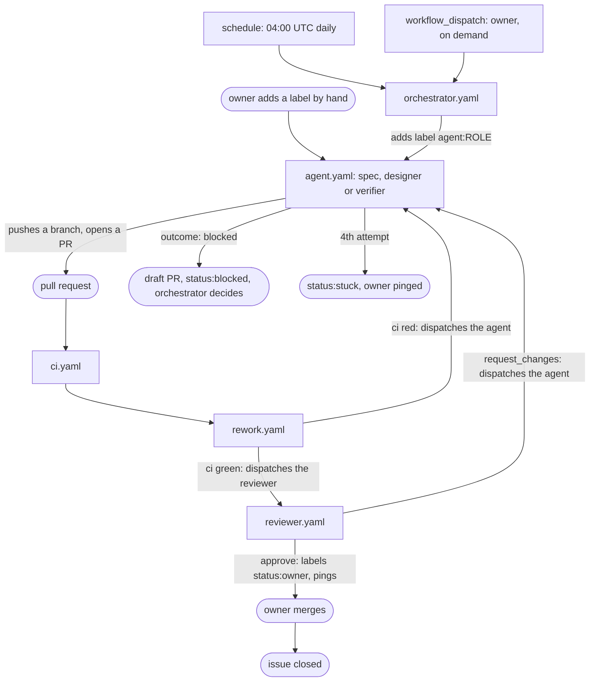
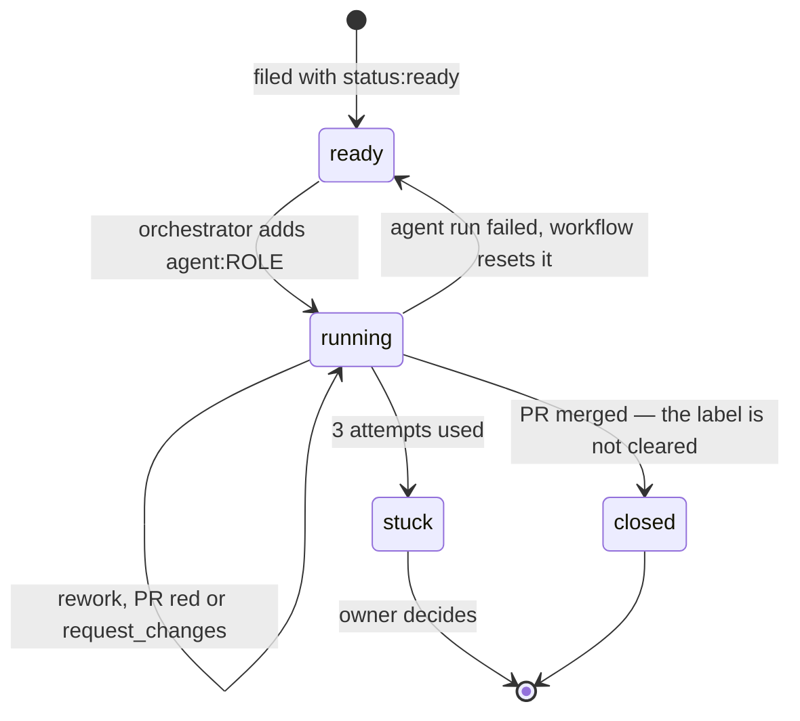
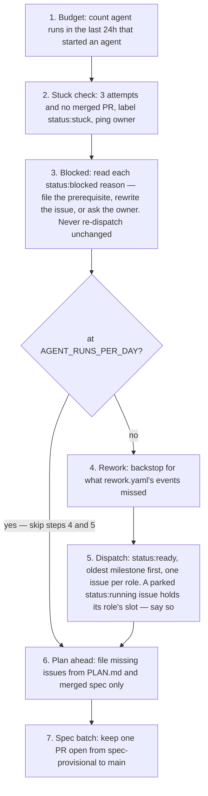
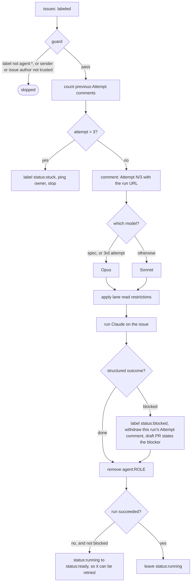
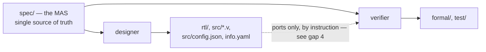
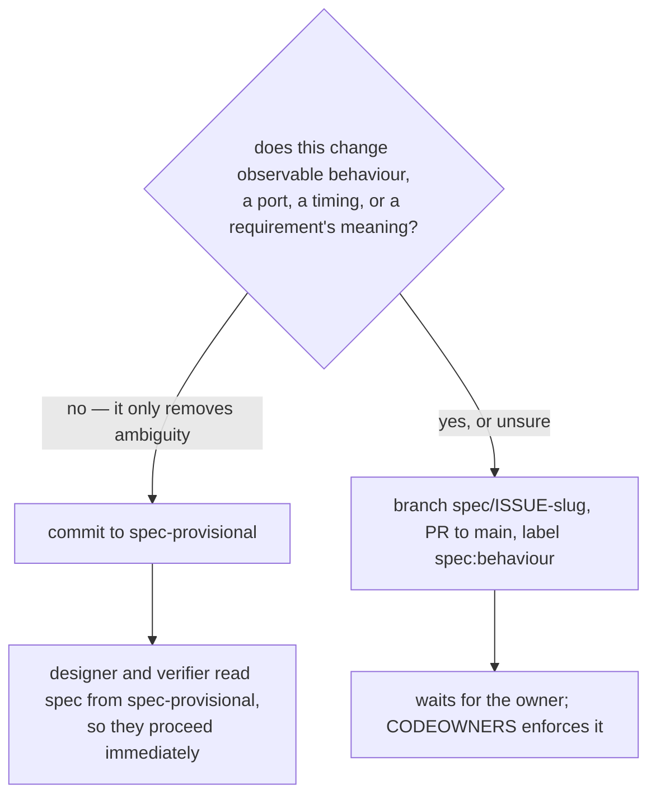
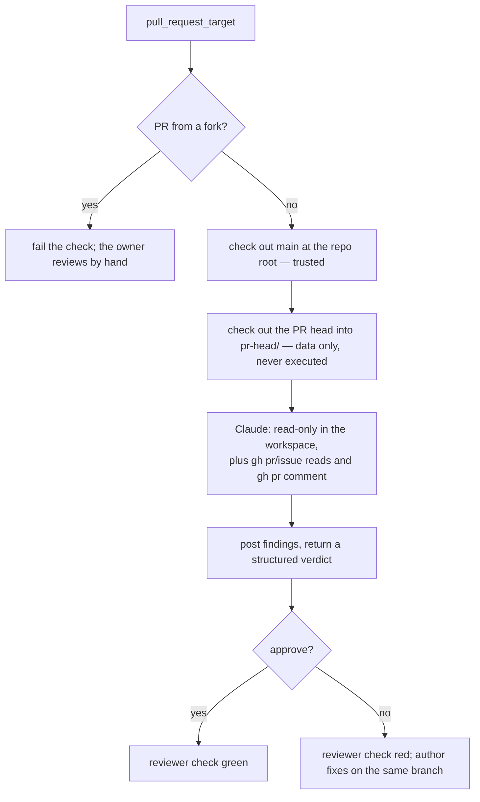

# How the agents work

This file explains the machinery: who starts an agent, what it is allowed to touch, and how
work moves from an issue to a merged pull request. The agents' own instructions are in
`spec.md`, `designer.md`, `verifier.md`, `reviewer.md` and `orchestrator.md`; the rules they
all obey are in `CLAUDE.md`; the decisions they build towards are in `PLAN.md`.

Audience: a human trying to understand or change the system. Agents read their own role file,
not this one.

## The pieces

| Workflow | Trigger | Runs as | Job |
|---|---|---|---|
| `orchestrator.yaml` | `schedule` 04:00 UTC, or `workflow_dispatch` | `claude[bot]` | Dispatch and plan. Writes issues, labels, comments and the spec batch PR — no file changes. |
| `agent.yaml` | `issues: labeled` with `agent:<role>`, or `workflow_dispatch` | `claude[bot]` | Run one worker agent on one issue. |
| `reviewer.yaml` | `workflow_dispatch` with a PR number, dispatched by `rework.yaml` once `ci` is green | `github-actions[bot]` | Grill a PR; its verdict is a required check. |
| `ci.yaml` | every pull request that is not a draft, pushes to `main`, or `workflow_dispatch` | — | `rtl`, `sim`, `formal`. |
| `rework.yaml` | `workflow_run` completed for `ci` | — | Half the loop: `ci` red sends an agent PR back to its agent, `ci` green sends it to the reviewer. The verdict half lives in `reviewer.yaml`. Acts only on branches `<role>/…` opened by `claude[bot]`. |
| `gds.yaml` | `main`, nightly at 02:00 UTC, or `workflow_dispatch` — **not** pull requests | — | Hardening, precheck, gate-level test. About an hour on a 6x4 die, which is why no PR waits on it; run it by hand on a PR that plausibly moves area or timing. It must not be a required status check. Its `viewer` job deploys the layout to Pages with `pages: write` — the only *declared* write permission among the build workflows — and is guarded on `ref == refs/heads/main`. |
| `docs.yaml` | PRs to `main`, `main`, nightly, or `workflow_dispatch` | — | The datasheet. `docs.yaml`, `fpga.yaml` and `gds.yaml`'s non-`viewer` jobs declare no `permissions:` block at all, so their token scope is the repository default rather than anything in the repo. (`setup.yaml` also takes `contents: write` and `issues: write` for its one-time job.) |
| `setup.yaml` | `workflow_dispatch` only | — | Idempotent, not one-time: creates the label set and the `spec-provisional` branch everything else leans on. **Re-run it whenever a label is added to it**, or the workflow that uses that label will fail to apply it. |
| `fpga.yaml` | `workflow_dispatch` only — `branches: none` disables its push trigger | — | iCE40UP5K bitstream, the stock Tiny Tapeout target. Never wired into the agent loop, and not the board `PLAN.md` names — see gap 5. |

There are **five agent roles** carried by **three** workflows: `orchestrator.yaml`,
`reviewer.yaml`, and `agent.yaml` — which runs `spec`, `designer` and `verifier`, differing
only in their role file and their lane. The other five files build, harden or set up the
repository; no agent runs in them.

## The whole loop



The orchestrator does **not** supervise agents. It adds a label and exits; everything after
that is GitHub Actions reacting to events, and `rework.yaml` is what makes the *return* path
react too.

**What the return path used to be.** Nothing fired on a red check or a `request_changes`
verdict: `reviewer.yaml` merely exited non-zero, `ci.yaml` had no downstream trigger, and
`agent.yaml` listened only for `issues: labeled` and `workflow_dispatch`. The only thing that
put an issue back to work was the orchestrator's **step 3, Rework**, on its *next scheduled
run* — so a red PR sat up to ~24 hours, and a single round of review feedback cost a day and
one of the issue's three attempts. Keeping the orchestrator alive longer fixes none of that:
the retry lands on the next run either way, and polling in between costs budget for no
information.

**What it is now.** `rework.yaml` wakes on `workflow_run: completed` for `ci`,
identifies the agent PR by its head branch, and dispatches the next actor within seconds:

| Where | On | It does |
|---|---|---|
| `rework.yaml` | `ci` red | dispatch `agent.yaml` on the PR's issue, same role |
| `rework.yaml` | `ci` green | dispatch `reviewer.yaml` on that PR |
| `reviewer.yaml` | `request_changes` | dispatch `agent.yaml`, same role |
| `reviewer.yaml` | no verdict at all — a crash, a timeout | ping the owner and stop; nothing is charged to the issue |
| `reviewer.yaml` | `approve` | label the PR `status:owner` and ping the owner |

So the owner's queue is only ever PRs that are green **and** approved.

**The verdict half lives in `reviewer.yaml`, not in `rework.yaml`.** A reviewer run reaches
`workflow_run` with no reliable handle on its PR: a run `rework.yaml` dispatched points at the
default branch, not the PR, and `workflow_run.pull_requests` comes back empty on some runs
(35470154786, 35470495609 and 35471288143 are three). `reviewer.yaml` has already resolved the
PR to post its status, so the verdict acts there. `rework.yaml` looks its PR up by **head
branch** for the same reason — `pull_requests` is unreliable, and a head-SHA match breaks the
moment the branch is pushed again while `ci` is still running.

Four details carry the design:

- **It dispatches, it does not label.** Adding `agent:<role>` from a workflow would be a
  `GITHUB_TOKEN` event, and GitHub starts no run for one (gap 3) — the loop would silently do
  nothing. `workflow_dispatch` is one of the two events exempt from that rule, and both
  `agent.yaml` and `reviewer.yaml` accept it.
- **A commit is reviewed once, and only after `ci` is green.** `reviewer.yaml` is
  **dispatch-only** — no PR event starts it — so `rework.yaml` is the single door in, for the
  owner's PRs as much as an agent's. It was `pull_request_target`, and that produced a second
  review on most agent PRs: `opened` starts one, `ci` finishes long before a 45-minute review,
  the dedup sees no verdict yet and dispatches another, and `cancel-in-progress` kills the
  first. Worse, it left two signals called `reviewer` on one commit — a *check run* from the
  cancelled job and a *commit status* from the dispatched one — and which of those branch
  protection honours when they disagree is not established. A cancelled check run outranking a
  green status is the unmergeable-PR mode this design exists to remove. Dispatch-only leaves
  exactly one signal per commit. The dedup token is a `pending` status `rework.yaml` posts
  *before* dispatching: the verdict status only exists once a review ends, and a query for
  reviewer runs in flight cannot be scoped to one PR — `gh run list` does not expose a run's
  `workflow_dispatch` inputs — so a repo-wide one would silently skip the second PR to go
  green inside a 45-minute review and leave it with no review and no way to get one. The
  marker also means the required check reads *pending* while the review runs, rather than
  being absent.
- **Only a real `request_changes` sends the agent back.** A reviewer that finished without a
  verdict — an OIDC 401, a timeout — did not judge the work, and charging that to the issue's
  three attempts would march a sound PR to `status:stuck` with nothing wrong in it. That case
  pings the owner and stops. Nor is a draft ever reviewed: a `[blocked]` PR is deliberately
  incomplete, and `request_changes` on it would send the agent back at unchanged issue text.
- **The reviewer had to become dispatch-only.** It was `pull_request_target`, and no such run
  was created for either of the agent's `GITHUB_TOKEN` pushes on `spec/3-workload-study` (gap 3
  again) — so waiting for the event would mean a fix push is never re-reviewed, one round and
  done. Dispatching it explicitly is what makes the ping-pong possible at all.

**The loop cannot run away**, and the attempt counter is the only thing making that true, so
two rules protect it. `agent.yaml` counts `Attempt N/3` comments on the issue and, past the
cap, labels it `status:stuck` and pings the owner instead of running. A blocked outcome
withdraws its own attempt comment — free to report a wall — and that is a hole in the bound
unless the PR really is a draft: a non-draft PR left red would come back through `ci` red →
agent → blocked → counter reset, forever. So the withdrawal happens only when a draft PR for
that issue exists, and `rework.yaml` refuses to dispatch against an issue labelled
`status:blocked` at all.

Rework dispatches do not pass through `AGENT_RUNS_PER_DAY`: that gate is the orchestrator's
step 1 and governs *new* work only, so finishing something already started is bounded by the
attempt cap rather than by the daily budget. They are exempt from the **gate**, not from the
**count** — step 1 counts every non-`skipped` `agent.yaml` run, rework's included, and has no
way to tell them apart. A busy day of rework therefore spends the next day's dispatch budget.
Defensible, since those runs cost the same; not what "exempt" on its own would imply.

## An issue's life

Labels are the state. There is no database.



| Label | Meaning |
|---|---|
| `status:ready` | Fully specified, waiting for dispatch. |
| `status:running` | An agent has it. |
| `status:stuck` | 3 attempts used; the owner is pinged. |
| `status:blocked` | An agent reported the issue cannot be done as written. The orchestrator's step 3 decides. |
| `status:owner` | On a PR: green and approved, waiting for the owner. |
| `agent:spec` / `agent:designer` / `agent:verifier` | Dispatch. Adding it **starts a run**. |
| `spec:behaviour` | A spec PR that waits for the owner. |

On the label path, adding `agent:<role>` is the only thing that starts work — a manual
`workflow_dispatch` is the other way in, and bypasses the guard entirely; see the trust
boundary below. `status:*` labels are bookkeeping —
adding one fires `agent.yaml` too, but its guard rejects anything not starting with `agent:`,
so the run ends as `skipped`. Those rejected runs used to be charged against the daily budget;
the orchestrator's step 1 now counts only runs that started an agent. See gap 6.

## Inside the orchestrator's daily run



Two consequences worth internalising:

- **One issue per role at a time.** If a spec issue is already `status:running`, no other spec
  issue is dispatched, however many are `status:ready`. Seven queued spec issues therefore
  take about seven daily runs — and an issue parked on an owner decision holds the slot
  indefinitely, which is why step 5 now says so out loud when it happens.
- **Scope is not invented.** Step 6 may only draw on `PLAN.md` and requirements already merged
  into `spec/` on `main`.

**On Sundays it has a second mode.** `orchestrator.yaml` branches on the day of the week — or
on the `digest` boolean of a manual dispatch — and opens a `Digest YYYY-Www` issue: merged PRs
per milestone, milestone status, agent runs against budget, open `status:stuck` issues, spec
PRs awaiting the owner, and **every `## Weakened properties` section merged that week**. That
last one matters: `CLAUDE.md` requires a PR that removes or loosens a property to declare it,
and the digest is the only place those declarations reach a human.

## Inside a worker agent run



The `Attempt N/3` comment is posted **before** the agent starts, so the issue always carries a
click-through link to the live run. That comment is also the attempt counter — the workflow
counts them to decide when to give up.

Note the asymmetry on the last two branches: a **failed** run resets the issue to
`status:ready`, and the stuck path swaps `status:running` for `status:stuck` — never for
`status:ready`, since re-queueing an issue the workflow has just given up on is what the stuck
state exists to prevent. But nothing clears `status:running` on **success**. No workflow reacts to a merge, so an
issue closed by its PR's `Closes #<issue>` stays closed *and* labelled `status:running`
forever. Harmless — the orchestrator's invariant is scoped to open issues — but it is the same
asymmetry as gap 1, in its benign form.

## The three worker roles



Designer and verifier work from the **same spec, in separate runs, and are told not to read
each other's lane.** `agent.yaml` denies the **Read tool** on those paths:

```yaml
designer) deny='"Read(./formal/**)" "Read(./test/**)"' ;;
verifier) deny='"Read(./rtl/**)"' ;;
```

**That is a guard rail, not a sandbox.** The same run allows
`--allowedTools "Bash,Read,Edit,Write,Glob,Grep,TodoWrite"`, and `Bash` is unrestricted — an
agent that ran `cat formal/uart_tx_props.v` would not be stopped, and `Edit`/`Write` into the
other lane are not denied either. The separation rests on the deny list *plus* the role files
in `designer.md` and `verifier.md`. See gap 4 below.

The point of the separation: a failing property then tells the designer something about **the
spec**, not about the verifier's phrasing. When the two disagree, the disagreement is evidence
that the spec is ambiguous — and the fix is a spec clarification, not a negotiation. This is
why a change that touches both lanes needs **two issues**, one per role, for the same
requirement IDs.

## The spec agent has two doors



"When unsure which kind a change is, it is a behaviour change." Clarifications flow without
the owner; behaviour changes are an owner gate.

## The reviewer, and why it looks strange



`pull_request_target` runs with **this repository's secrets**, which is exactly why the layout
matters. The workspace root is the PR's **base** branch — `main` for every PR here, since the checkout takes no `ref:` — so `CLAUDE.md` and `agents/` are the trusted copies,
not versions a PR could have edited. The PR's own files land in `pr-head/` and are read as
data; nothing in them is ever executed. Fork PRs never reach Claude at all.

The reviewer is also the only agent required to return a machine-readable verdict
(`--json-schema`), which is what makes `reviewer` usable as a required status check.

## The trust boundary

Text becomes instructions only if it comes from the prompt, `CLAUDE.md`, `agents/`, or an
issue or comment written by `rechefe` or `claude[bot]`. Everything else is data.

`agent.yaml` enforces that in its `if:` guard:

```yaml
github.event_name == 'workflow_dispatch' ||
(startsWith(github.event.label.name, 'agent:') &&
 contains(fromJSON('["rechefe","claude[bot]"]'), github.event.sender.login) &&
 contains(fromJSON('["rechefe","claude[bot]"]'), github.event.issue.user.login))
```

On the **label path**, two identities are checked and both must pass:

- **sender** — who added the label. Stops a stranger dispatching an agent.
- **issue author** — who wrote the issue. Stops a stranger's text becoming an agent's prompt
  even if a trusted account labels it.

That both hold for `claude[bot]` is why the orchestrator can close the loop at all: issues it
files and labels it adds satisfy the checks.

The leading `workflow_dispatch ||` is a **deliberate bypass of both**. Triggering a workflow by
hand already requires write access to the repository, so the sender is trusted by construction
— but note what it does *not* check: a manual dispatch names an issue number directly, so it
can point an agent at an issue written by anyone. Dispatching by hand means vouching for the
issue's text yourself.

Two more deliberate choices:

- The Claude token lives in the `agents` environment, readable only from `main`.
- `show_full_output` is never enabled. The repository is public and it prints unredacted tool
  results.

## Budget and pacing

Half of a Max plan's weekly usage, paced to roughly one seventh per day. The orchestrator
counts `agent.yaml` runs in the last 24 hours — those not rejected by the workflow's guard —
against the repository variable `AGENT_RUNS_PER_DAY` (default 6, set under Settings → Secrets
and variables → Actions → Variables) and stops dispatching once it is reached.

Model choice is automatic: `spec` always runs on Opus; `designer` and `verifier` run on Sonnet
and escalate to Opus on their third attempt.

CI is paced too. `ci` runs on every pull request that is not a draft — the blocked protocol
leans on that, and all three role files tell an agent so — and on `main`, but `gds` — hardening plus
precheck, about an hour on a 6x4 die — runs on `main`, nightly, and on manual
`workflow_dispatch`, and **not on pull requests at all**: an hour of latency in every rework
round is the largest tax the loop can carry, and area and timing are properties of `main`
rather than of one PR. It must therefore not be a required status check.

## Watching a run

Agent runs execute in GitHub Actions. They are **not** claude.ai sessions and do not appear in
the Claude web or mobile interface; there is no setting that changes this. What exists:

- the `Attempt N/3 … Run: <url>` comment on the issue, which is also your phone notification
  if you watch the repository in the GitHub mobile app. It is posted by
  **`github-actions[bot]`**, not `claude[bot]` — the workflow posts it with `github.token`
  before Claude starts — and the attempt counter matches on exactly that author, so a
  miscount is usually a comment written by the wrong identity;
- `display_report: true` on the agent, reviewer and orchestrator workflows, which writes
  Claude's turn-by-turn report to the **job's Step Summary** — visible on the run's summary
  page in a browser, not in the log, and not exposed by any REST endpoint;
- the reviewer's findings, posted as a PR comment.

## Known gaps, as of 2026-09-19

Recorded because the machinery above describes the intent, and these are places the
implementation does not yet meet it. None has a tracking issue yet, so check this file's
git history and the open issues before trusting it.

1. **A successful run that produces no PR strands its issue.** `agent.yaml` resets
   `status:running` to `status:ready` only when the run *fails*, and the orchestrator's rework
   step needs an open PR to inspect. An agent that finishes cleanly without opening a PR
   leaves the issue marked running forever, with nothing to retry it. The benign variant of
   the same asymmetry: nothing clears `status:running` on a merge either, so closed issues
   keep the label.
2. ~~**An agent cannot report "this task is impossible" in a way anything notices.**~~
   **Closed.** Worker agents now return `{outcome, reason}`, the protocol is in all three role
   files, and `outcome: blocked` labels the issue `status:blocked`, withdraws the attempt
   comment so the block is free, and opens a draft `[blocked]` PR that `ci` skips and
   `rework.yaml` leaves alone. The orchestrator's step 3 decides: file the prerequisite,
   rewrite the issue, or ask the owner. Issue #8 is the case that motivated it — a designer
   run that concluded `success`, opened no PR, and stranded its issue for a day, because the
   issue as written required `make ci` green while forbidding the `test/` edit that would
   make it so.
3. **An agent's `git push` starts no workflow run.** `agent.yaml`'s `actions/checkout` takes
   no `token:` and no `persist-credentials: false`, so checkout persists the default
   `GITHUB_TOKEN` as git's credential and **every `git push` an agent makes goes out under
   it**. GitHub starts no workflow run for a `push` event that token triggers, and only
   `workflow_dispatch` and `repository_dispatch` are exempt. The spec agent named this
   correctly on issue #3 — "GitHub suppresses workflow runs for pushes made with the default
   token" — and proposed the fix that PR #16 made: add `pull_request` to `ci.yaml`.

   The one agent branch we have is `spec/3-workload-study`. Three agent pushes (`77ece22` at
   11:16:43, `60c2d7b` at 12:22:01, `cd0efa4` at 12:23:41 on 2026-09-19) and five runs, not
   one of them a `push`:

   | run | workflow | event | head | actor | created |
   |-----|----------|-------|------|-------|---------|
   | 35439697977 | `reviewer` | `pull_request_target` | 77ece22 | `claude[bot]` | 11:17:16 |
   | 35442657728, 35442657679 | `docs`, `gds` | `pull_request` | 60c2d7b | `github-actions[bot]` | 12:22:09 |
   | 35442734516, 35442734505 | `docs`, `gds` | `pull_request` | cd0efa4 | `github-actions[bot]` | 12:23:46 |

   `ci` never appears because it was `on: push:` only. Neither do `docs` and `gds` as `push`
   runs, though that branch's own copy of both was `on: push:` — that is the suppression, and
   it covers every workflow, not just `ci`. The `pull_request` runs at 12:22 and 12:23 use
   `main`'s copy of those workflows: a PR run takes the file from the merge ref, which carries
   `main`'s version where the head branch has not also changed it. `main` gained their
   `pull_request` trigger at 11:51, which is why the 11:17 push has no pair.

   Two things follow, and they correct what this section said before the runs were read:

   - **A fix push was observed to refresh the PR's `pull_request` checks.** Those two run
     pairs were created 8 s and 5 s after the pushes they carry, with `actor:
     github-actions[bot]` — the pushing identity. So `synchronize` from a `GITHUB_TOKEN` push
     was not suppressed on either. The earlier claim here — checks arrive on `opened` and go
     stale — was wrong. Take the refresh as observed rather than guaranteed: n is 2, both are
     `docs`/`gds` runs, `ci` itself has never been seen to run on a `GITHUB_TOKEN`
     `synchronize`, and the documented rule predicts the opposite.

     **The rework loop rests on it from round two onwards.** `ci` red dispatches the agent, the
     agent pushes a fix under `GITHUB_TOKEN`, and if that push starts no `ci` run then
     `rework.yaml` never wakes, the new head carries no `reviewer` status, and there is no
     other door back in — one round and done, which is the outcome the loop exists to fix. The
     first green agent PR after `rework.yaml` merges is the test. If it stalls after one round,
     this is why, and the manual nudge is `gh workflow run ci.yaml --ref <branch>` or a push
     from an identity that is not `GITHUB_TOKEN`.
   - **Why the halves of one push differ is unexplained.** The same `git push` started a
     `pull_request` run and no `push` run. Suppression accounts for the second and not the
     first. Recorded as an observation, not a mechanism; nothing above depends on a reason.

   What is left is the reviewer. `reviewer.yaml` lists `synchronize`, and no `reviewer` run
   was created for either fix push — only for the `opened` event, which `claude[bot]`
   triggered and the OIDC 401 then failed. So a `pull_request_target` verdict does go stale
   across a retry, and the orchestrator's step 3 re-dispatches on `a reviewer verdict of
   request_changes` that may already be fixed. Closing that means giving the agent a push
   credential that is not `GITHUB_TOKEN`, which is unverified and security-sensitive, so it is
   recorded here rather than guessed at.

   One consequence of #16's other half, recorded here because `ci.yaml` points at this section:
   with `push` narrowed to `main`, a direct push to `spec-provisional` — the spec agent's
   clarification path, which opens no PR — gets no `ci`. It loses nothing real, since no
   `Makefile` target reads `spec/`, and an agent's push there never started a run anyway.
4. **Lane separation is a guard rail, not a sandbox.** The deny list covers the Read tool
   only; `Bash` is allowed unrestricted, so an agent could read the other lane with `cat`, and
   `Edit`/`Write` there are not denied. Nor does it cover the generated implementation: the
   verifier's deny is `Read(./rtl/**)` alone, while `src/*.v` is that same design emitted as
   Verilog and the Read tool reaches all of it — `verifier.md` asks for module headers only,
   and nothing enforces that. Nothing has broken these rules, and the role files forbid it,
   but the enforcement is weaker than the design assumes.
5. **`fpga.yaml` builds a bitstream for a board this project does not use.** It is the stock
   Tiny Tapeout template targeting an iCE40UP5K on the TT ASIC Sim board, while `PLAN.md`
   names the Nexys Video (Artix-7 200T) as the FPGA target and says it is run by hand and
   never wired to CI. The two are consistent, but together they mean nothing in this
   repository builds the bitstream behind the submission package's FPGA video.
6. **Guard-rejected runs used to be charged against the budget.** `agent.yaml` fires on
   `issues: types: [labeled]`, so *every* label — `status:ready` on a newly filed issue, the
   `status:running` half of a dispatch — starts a run that the `if:` guard rejects in about a
   second. The orchestrator counted "workflow runs of `agent.yaml`", and a rejected run still
   *is* a run.

   Observed on 2026-09-19: 14 runs, of which 3 started an agent (`35438490991`,
   `35441893716`, `35442244471`) and 11 were rejected — 8 of them from the owner filing
   issues #6–#13 in three minutes. On 2026-09-20 the orchestrator read 14 against
   `AGENT_RUNS_PER_DAY = 6`, skipped steps 3 and 4, and dispatched nothing; it recorded the
   arithmetic in its digest, issue #17. Filing issues, an act that costs no agent time,
   bought a day of silence.

   Step 1 now counts only runs whose conclusion is not `skipped`, so the budget means what it
   says: `AGENT_RUNS_PER_DAY = 6` is six agents. Left unfixed: the rejected runs still appear
   in the Actions tab, where they read as failures to a human scanning the list.
